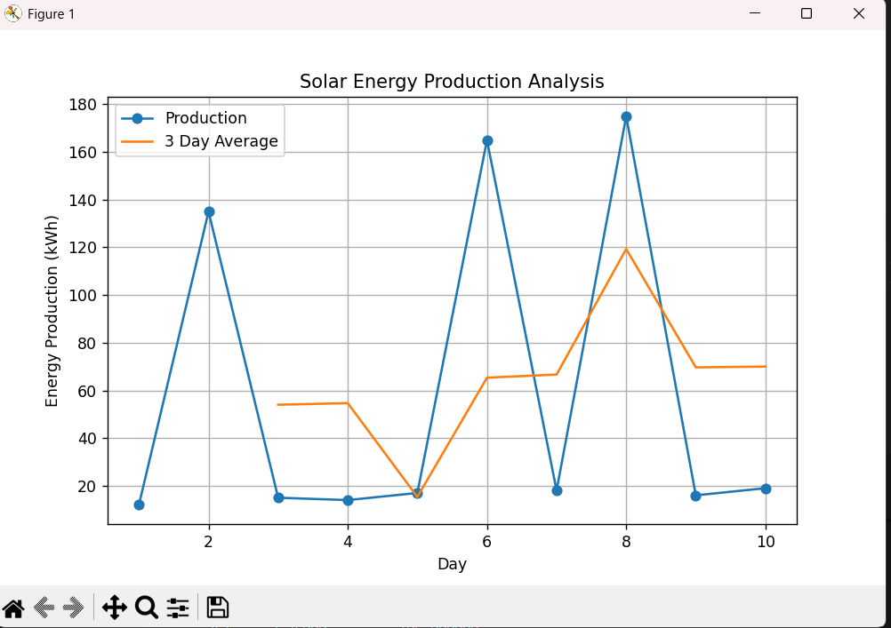

# Solar Energy Data Analysis

This project analyzes solar energy production data using Python.

## Technologies
- Python
- Pandas
- Matplotlib

## Features
- Loads solar production dataset
- Calculates statistics (average, maximum)
- Computes rolling averages
- Visualizes production trends

## Output Example

## Run the Project

Install dependencies:

pip install -r requirements.txt

Run:

py analysis.py

## Purpose

Portfolio project demonstrating data analysis and visualization skills for backend and data roles.
